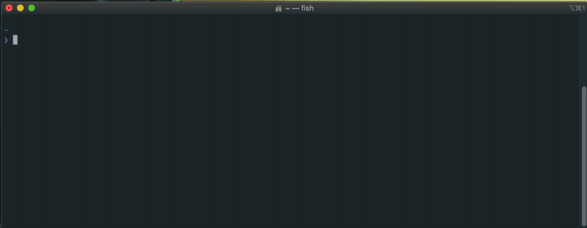

# Dirscan [](https://crates.io/crates/dirscan) [](https://github.com/orf/dirscan/actions)



Dirscan is a high-performance tool for quickly inspecting the contents of large disks. It provides a summary of every 
single directory on a given disk, complete with the number of files within, their total size, and the latest time a 
file was created, accessed or modified. 

Dirscan:

* Is significantly faster than tools like `ncdu`, `find` or `tree`
* Implements a memory-saving dictionary of common path segments to drastically reduce memory usage 
* Produces a simple JSON or CSV output that can be analysed by the built in viewer or other tools
* Supports a customisable number of threads
 

Table of Contents
=================

   * [Install :cd:](#install-cd)
      * [Homebrew (MacOS   Linux)](#homebrew-macos--linux)
      * [Binaries (Windows)](#binaries-windows)
      * [Cargo](#cargo)
   * [Usage :saxophone:](#usage-saxophone)
      * [Scan a directory](#scan-a-directory)
      * [Inspect results](#inspect-results)

# Install :cd:

## Homebrew (MacOS + Linux)

`brew tap orf/brew`, then `brew install dirscan`

## Binaries (Windows)

Download the latest release from [the github releases page](https://github.com/orf/dirscan/releases). Extract it 
and move it to a directory on your `PATH`.

## Cargo

For optimal performance run `cargo install dirscan`

# Usage :saxophone:

## Scan a directory

You can start scanning a directory by executing:

`dirscan scan [PATH] --output=[OUTPUT]`

This will scan `[PATH]` and output all results, in JSON format, to `[OUTPUT]`. By default it will use a thread pool with 
`2 * number_of_cores` threads, but you can customize this. Depending on your disk speed the number of threads can 
drastically improve performance:

`dirscan scan [PATH] --output=[OUTPUT] --threads=20`
 
You can also output the results in CSV:

`dirscan scan [PATH] --output=[OUTPUT] --format=csv`

```
$ dirscan scan ~/ --output=output.json --threads=20
[00:00:15] Files/s: 17324/s | Total: 258734 | Directories: 34842 | Size: 99.01GB | Components: 14291 | Errors: IO=0 Other=36
```
 
## Inspect results

Once a scan is complete you can inspect the output using:

`dirscan parse [OUTPUT]`

For example:

```
$ dirscan parse output.json --prefix=/System/
[00:00:02] Total: 580000 | Per sec: 220653/s
+----------------------+---------+----------+-------------+-------------+-------------+
| Prefix               | Files   | Size     | created     | accessed    | modified    |
+----------------------+---------+----------+-------------+-------------+-------------+
| /System/Applications | 57304   | 777.28MB | 2 weeks ago | 2 weeks ago | 2 weeks ago |
| /System/DriverKit    | 55      | 5.09MB   | 2 weeks ago | 2 weeks ago | 2 weeks ago |
| /System/Library      | 292190  | 13.56GB  | 7 hours ago | 1 hour ago  | 7 hours ago |
| /System/Volumes      | 1468296 | 197.93GB | 1 hour ago  | 1 hour ago  | 1 hour ago  |
| /System/iOSSupport   | 13856   | 600.20MB | 2 weeks ago | 2 weeks ago | 2 weeks ago |
+----------------------+---------+----------+-------------+-------------+-------------+
```

You can include more directories with the `--depth` flag, or change the prefix search with `--prefix`.

You can also order the results by `name` (the default), `size` or `files`:

```
$ dirscan parse output.json --prefix=/System/ --sort=size
[00:00:02] Total: 580000 | Per sec: 220653/s
+----------------------+---------+----------+-------------+-------------+-------------+
| Prefix               | Files   | Size     | created     | accessed    | modified    |
+----------------------+---------+----------+-------------+-------------+-------------+
| /System/Volumes      | 1468296 | 197.93GB | 2 hours ago | 2 hours ago | 2 hours ago |
| /System/Library      | 292190  | 13.56GB  | 7 hours ago | 2 hours ago | 7 hours ago |
| /System/Applications | 57304   | 777.28MB | 2 weeks ago | 2 weeks ago | 2 weeks ago |
| /System/iOSSupport   | 13856   | 600.20MB | 2 weeks ago | 2 weeks ago | 2 weeks ago |
| /System/DriverKit    | 55      | 5.09MB   | 2 weeks ago | 2 weeks ago | 2 weeks ago |
+----------------------+---------+----------+-------------+-------------+-------------+
```